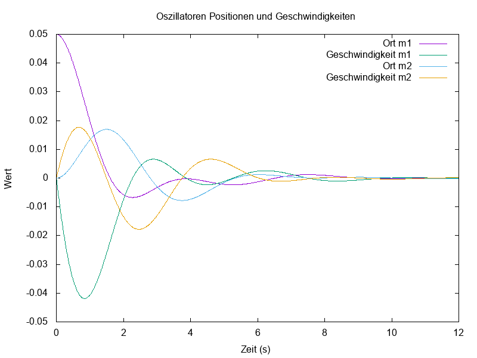
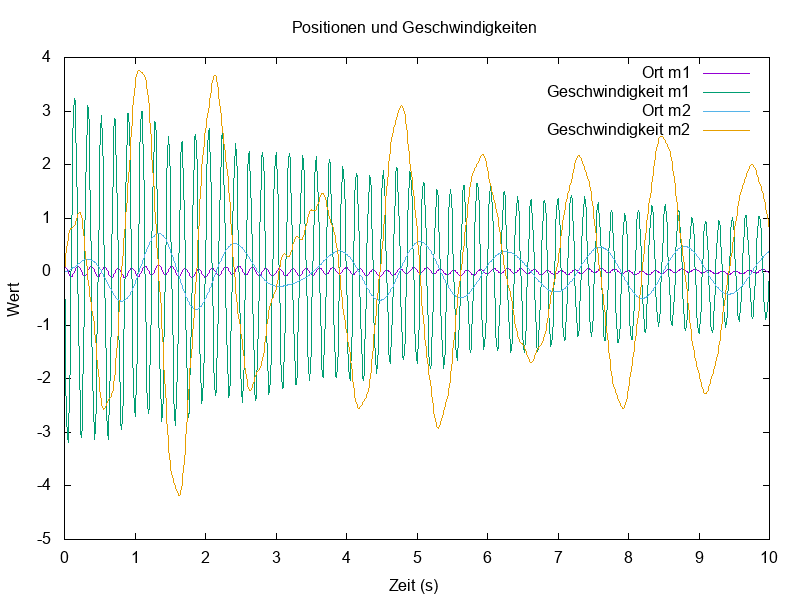

 
## System mit einer Masse ohne externe Kraft

Das geschriebene Programm befindet sich im Ordner **OhneExterneKraft_eineMasse**.

Da es das größte der folgenden Programme ist, wurde es in eine Funktionen/Strukturen.cpp, eine Header.hpp und eine main.cpp datei unterteilt, es wird wie folgt kompiliert:

- g++ -std=c++17 -o noFoneM noFoneM.cpp noFoneM_modul.cpp -lboost_iostreams -lboost_system -lboost_filesystem

Modelliert wird der Verlauf von x und v gegenüber der Zeit, mit beliebigen Anfangsbedingungen. Die Anfangsbedingungen können in der Datei [`noFoneM_initial.dat`](noFoneM/noFoneM_initial.dat) verändert werden. Das Programm liest diese ein, wendet das **modifizierte Eulerverfahren** darauf an und gibt die erhaltenen Werte für t sowie die jeweils korrespondierenden x und v in der Ausgabedatei [`noFoneM_out.dat`](noFoneM/noFoneM_out.dat) aus. Anschließend wird mittels *gnuplot-iostream* ein PNG erzeugt, das die Ausgabedatei veranschaulicht.

Außerdem enthält das Programm eine Funktion zur Berechnung:

1. **Der mittleren Periodendauer**,  
2. **Der maximalen Geschwindigkeit** (Vorzeichen ist relevant),

Diese Werte werden in der Datei [`noFoneM_aufgaben.dat`](noFoneM/noFoneM_aufgaben.dat) ausgegeben.

Des Weiteren gibt es eine Funktion zur Berechnung **der Amplituden über der Zeit**. Diese werden in der Datei [`noFoneM_amplituden.dat`](noFoneM/noFoneM_amplituden.dat) ausgegeben.  
- In der **1. Spalte** steht die Zeit,  
- in der **2. Spalte** stehen die Amplituden,  
- in der **3. Spalte** die Logarithmen der Amplituden.

Aus diesen Daten werden zwei Gnuplot-Plots in PNG-Dateien erzeugt:

1. Zeit vs. Amplitude in [`noFoneM_amplitude_plot.png`](noFoneM/noFoneM_amplitude_plot.png),  
2. Zeit vs. log(Amplitude) in [`noFoneM/noFoneM_logAmplitude_plot.png`](noFoneM/noFoneM_logAmplitude_plot.png).

Aus der Steigung der (im Idealfall) Geraden im zweiten Fall ergibt sich die mittlere Abklingzeit. Siehe Ende der Datei [`noFoneM_amplituden.dat`](noFoneM/noFoneM_amplituden.dat).

---

### Ausgewählte Plots, erstellt mit dem obigen Programm für bestimmte Anfangsbedingungen

#### 1.)

- **Werte**:  
  [`Parametersatz 1`](noFoneM/noFoneM_initial1.dat)

- **Zeit vs. x und v**:  
  

  Die Dämpfung führt dazu dass das system zu einem Ruhezustand x = 0, strebt.

- **Amplituden**:  
  

  Man sieht die Amplituden nehmen exponentiell ab.

- **Logarithmen der Amplituden**:  
  

  Aus dieser Steigung wurde berechnet und ist zu sehen in: [noFoneM_amplituden.dat](noFoneM/noFoneM_amplituden1.dat)

- **Aufgaben `.dat` File**:  
  [`Aufgaben1`](noFoneM/noFoneM_aufgaben1.dat)

---

#### 2.)

- **Werte**:  
  [`Parametersatz 1 mit doppelter Masse`](noFoneM/noFoneM_initial2.dat)

- **Zeit vs. x und v**:  
  
  Die Schwingung hält länger an.

- **Amplituden**:  
  

- **Logarithmen der Amplituden**:  
  

- **Aufgaben `.dat` File**:  
  [`Aufgaben2`](noFoneM/noFoneM_aufgaben2.dat)

---

#### 3.)

- **Werte**:  
  [`Parametersatz 1 mit b = 0`](noFoneM/noFoneM_initial3.dat)

- **Zeit vs. x und v**:  
  

  *Kommentar*:  
  Es gibt keinen Abfall auf 0 wie bei gedämpften Oszillationen. Ohne Dämpfung bleibt die Schwingung erhalten.

- **Amplituden**:  
  

  *Kommentar*:  
  Wir sehen, die Amplitude ist  konstant (siehe y-Achsen werte).

- **Aufgaben `.dat` File**:  
  [`Aufgaben3`](noFoneM/noFoneM_aufgaben3.dat)

---

#### 4.)

- **Werte**:  
  [`Parametersatz 1 mit halbiertem k`](noFoneM/noFoneM_initial4.dat)

- **Zeit vs. x und v**:  
  

- **Amplituden**:  
  

- **Logarithmen der Amplituden**:  
  

- **Aufgaben `.dat` File**:  
  [`Aufgaben4`](noFoneM/noFoneM_aufgaben4.dat)

---

## System mit 2 Massen ohne externe Kraft

Das geschriebene Programm befindet sich im Ordner **OhneExterneKraft_zweiMassen**.

Hier modellieren wir ein System mit 3 Federn und 2 Massen ohne äußere Kraft. Wir gehen ähnlich vor wie oben. Der Input wird in die Datei [`noFtwoM_initial.dat`](noFtwoM/noFtwoM_initial.dat) geschrieben.

Mit dem **modifizierten Eulerverfahren** modellieren wir Zeit zu: (x_1, v_1, x_2, v_2). Die Ergebnisse werden in einer Datei [`noFtwoM_out.dat`](noFtwoM/noFtwoM_out.dat) gespeichert und anschließend per *gnuplot iostream* ein PNG erzeugt, das diesen Verlauf grafisch darstellt ([`noFtwoM_plot.png`](noFtwoM/noFtwoM_plot.png)).

### Ausgewählte Plots mit bestimmten Anfangsbedingungen

#### 1.)

- **Werte**:  
  [`Parametersatz 2 (m = k = b und x02 = 0)`](noFtwoM/noFtwoM_initial1.dat)

- **Zeit vs. x_1, v_1, x_2, v_2**:  
  

---

#### 2.)

- **Werte**:  
  [`Parametersatz 2 mit x01 = x02 != 0`](noFtwoM/noFtwoM_initial2.dat)

- **Zeit vs. x_1, v_1, x_2, v_2**:  
  

  x_1 = x_2 und v_1 = v_2.

---

#### 3.)

- **Werte**:  
  [`Parametersatz 2 mit x01 = - x02 != 0`](noFtwoM/noFtwoM_initial3.dat)

- **Zeit vs. x_1, v_1, x_2, v_2**:  
  

---

#### 4.)

- **Werte**:  
  [`Parametersatz 2 mit m1 >> m2`](noFtwoM/noFtwoM_initial4.dat)

- **Zeit vs. x_1, v_1, x_2, v_2**:  
  

---

#### 5.)

- **Werte**:  
  [`Parametersatz 2 mit k2 << k1 = k3`](noFtwoM/noFtwoM_initial5.dat)

- **Zeit vs. x_1, v_1, x_2, v_2**:  
  

---

## System mit einer Masse mit externer Kraft

Das geschriebene Programm befindet sich im Ordner **MitExterneKraft_eineMasse**.

Wir modellieren ein System mit einer Masse, einer Feder und einer **periodischen äußeren Kraft**. Die Anfangsbedingungen werden aus der Datei [`withFoneM_initial.dat`](withFoneM/withFoneM_initial.dat) gelesen. Erneut verwenden wir das *modifizierte Eulerverfahren* und geben die errechneten Datenpunkte in einer Datei [`withFoneM_out.dat`](withFoneM/withFoneM_out.dat) aus. Danach wird über *gnuplot iostream* ein PNG erzeugt, das die Daten aus der `withFoneM_out.dat` graphisch darstellt.

### Ausgewählte Plots mit bestimmten Anfangsbedingungen

#### 1.)

- **Werte**:  
  [`Parametersatz 3`](withFoneM/withFoneM_initial1.dat)

- **Zeit vs. x_1, v_1**:  
  

---

#### 2.)

Wir betrachten nun den Fall der **Resonanzkatastrophe**, wobei  
Omega_res = sqrt(k/m)  
des (hier ohne äußere Kraft) ungetriebenen Systems ist, oder  
Omega_res = 2*pi / T.  

Wir wählen schwache Dämpfung:

- **Werte**:  
  [`Parametersatz 4`](withFoneM/withFoneM_initial2.dat)

- **Zeit vs. x_1, v_1**:  
  

Wir sehen, die Amplitude nimmt mit der Zeit zu und wird immer größer (theoretisch unbeschränkt ohne genügend Dämpfung).

Nun betrachten wir den Resonanzfall einmal mit 0 Dämpfung und mit hoher Dämpfung:

- **Null Dämpfung** (b = 0):  
  

- **Hohe Dämpfung** (b = 0.5):  
  

---

### 3.)

Nun ändern wir im „normalen“ (nicht Resonanzkatastrophe-) Fall wieder die Masse:

- **Werte**:  
  [`Parametersatz 3 mit 10 mal so viel Masse`](withFoneM/withFoneM_initial5.dat)

- **Zeit vs. x_1, v_1**:  
  

---

## System mit zwei Massen mit externer Kraft

Das geschriebene Programm befindet sich im Ordner **MitExterneKraft_zweiMassen**.

Wir modellieren ein System mit zwei Massen, zwei Federn und einer **periodischen äußeren Kraft**. Die Anfangsbedingungen werden aus der Datei [`withFtwoM_initial.dat`](withFtwoM/withFtwoM_initial.dat) gelesen. Wieder verwenden wir das *modifizierte Eulerverfahren* und geben die errechneten Datenpunkte in [`withFtwoM_out.dat`](withFtwoM/withFtwoM_out.dat) aus. Danach wird über *gnuplot iostream* ein PNG erzeugt, das die Daten aus dieser Datei graphisch darstellt.

### Ausgewählte Plots mit bestimmten Anfangsbedingungen

- **Werte**:  
  [`Parametersatz 5`](withFtwoM/withFtwoM_initial1.dat)

  - **Zeit vs. x_1, v_1, x_2, v_2**:  
    

- **Werte**:  
  [`Parametersatz 5 mit m1 10 mal so groß`](withFtwoM/withFtwoM_initial2.dat)

  - **Zeit vs. x_1, v_1, x_2, v_2**:  
    

- **Werte**:  
  [`Parametersatz 5 mit ein Zehntel F`](withFtwoM/withFtwoM_initial3.dat)

  - **Zeit vs. x_1, v_1, x_2, v_2**:  
    

- **Werte**:  
  [`Parametersatz 5 mit ein Fünftel Omega`](withFtwoM/withFtwoM_initial4.dat)

  - **Zeit vs. x_1, v_1, x_2, v_2**:  
    

- **Werte**:  
  [`Parametersatz 5 mit k1 zehnmal so groß`](withFtwoM/withFtwoM_initial5.dat)

  - **Zeit vs. x_1, v_1, x_2, v_2**:  
    

---

### Akustisches Phonon

Dabei schwingen die Massen in Phase (ohne Phasenverschiebung). Für das Phänomen des **akustischen Phonons** braucht es eine Symmetrie der Form:

m1 = m2, k1 = k2, x1 = x2 != 0.

- **Werte dafür**:  
  [`Parametersatz 6`](withFtwoM/withFtwoM_initial6.dat)

  - **Zeit vs. x_1, v_1, x_2, v_2**:  
    

---

### Optisches Phonon

Dabei schwingen die Massen gegenläufig (Phasen um 180° verschoben). Für das Phänomen des **optischen Phonons** braucht es ebenfalls die Symmetrie:

m1 = m2, k1 = k2

und eine antisymmetrische Auslenkung:

x1 = - x2 != 0.

- **Werte dafür**:  
  [`Parametersatz 7`](withFtwoM/withFtwoM_initial7.dat)

  - **Zeit vs. x_1, v_1, x_2, v_2**:  
    

---

### Chaotisches Verhalten

Nach Tests mit mehreren Anfangsbedingungen konnte **kein** eindeutig chaotisches Verhalten durch minimale Änderungen eines Koeffizienten festgestellt werden. Allerdings gibt es Situationen, in denen sich das System nicht ganz „uniform“ verhält, was gelegentlich scheinbar unregelmäßige Muster ergibt.

- **Werte dafür**:  
  [`Parametersatz 8`](withFtwoM/withFtwoM_initial8.dat)

  - **Zeit vs. x_1, v_1, x_2, v_2**:  
    

---
